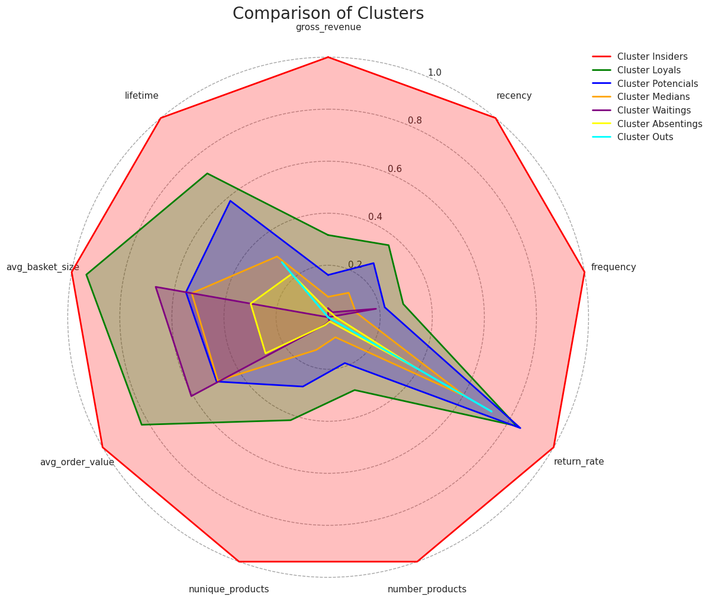

# Customer Loyalty Program - Clustering 

**In today's dynamic business scenery, where customer loyalty plays a pivotal role in driving sustainable growth, implementing a well-designed loyalty program has become a key priority for businesses across various industries. By stimulating deeper connections with customers, loyalty programs have proven to be effective in driving repeat purchases, increasing customer engagement, and ultimately boosting profitability.**

**In this project, Big Box (a fictional e-commerce platform) extracts the maximum potential of customer purchase data to implement a clustering customer strategy for the creation of a loyalty program. By utilizing this strategy, Big Box seeks to gain a comprehensive understanding of its customers, enabling them to make informed decisions, implement targeted marketing campaigns, and develop strategies that maximize customer retention and lifetime value.**

## **1 - Business Problems**

### **1.1 - Big Box**
Big Box is a fictional e-commerce company with its headquarters based in the UK. It offers a wide range of products catering to various categories, including home decor, party supplies, kitchen accessories, storage solutions, and much more.

### **1.2 - Business Problems**
After successfully selling a wide range of products and accumulating a substantial customer base, Big Box recognizes the immense value hidden within its customer data. The company aims to harness the power of data science to gain deeper insights into its customer base and apply those insights strategically. One of their primary objectives is to segment their customers effectively.
This segmentation will enable Big Box to understand its customer base on a more granular level, identify specific customer groups with distinct needs and preferences, and tailor their marketing efforts and product offerings accordingly.

Furthermore, by implementing a loyalty program, Big Box seeks to cultivate stronger customer relationships and enhance customer retention. Through careful analysis of customer behaviors, purchasing patterns, and preferences, they can design a loyalty program that provides personalized incentives, rewards, and exclusive benefits to different customer segments. This personalized approach not only fosters customer loyalty but also creates a sense of appreciation and belonging among customers, further strengthening their connection with the brand.

### **1.3 - About the data**

---
| Column Name | Description                                            |
|-------------|--------------------------------------------------------|
| InvoiceNo   | Invoice number, a unique identifier for each transaction |
| StockCode   | Product code, a unique identifier for each product       |
| Description | Product description                                     |
| Quantity    | Quantity of products purchased in each transaction      |
| InvoiceDate | Date and time of each transaction                        |
| UnitPrice   | Unit price of each product                              |
| CustomerID  | Customer ID, a unique identifier for each customer       |
| Country     | Country of the customer 

---

&nbsp;

## **2 - Solution Strategy**

**CRISP-DM** stands for Cross Industry Standard Process for Data Mining, which can be translated as Standard Process for Inter-Industry Data Mining. It is a data mining process model that describes commonly used approaches by data mining experts to tackle problems.

In this project, CRISP-DM serves as the foundational framework. Its primary objective is to deliver value to the company rapidly and continuously improve project performance over time by leveraging iterative cycles.

The project includes three cycles, each of which contributes significant value and provides valuable insights to the company. 

This iterative approach allows for the refinement and enhancement of the project's outcomes, ensuring that the company continually benefits from the insights gained.

### **2.1 - Project Planning:**

The initial stage of this project involves gaining a comprehensive understanding of the data, exploring possible solutions by looking at other strategies already used in other companies, and developing a well-defined plan for the development of the project.

Notes for this project plan can be viewed here: [Notes](project_notes.md)

### **2.2 - Cycles:**
#### **Cycle 01 - RFM**
As the company currently lacks customer segmentation and the data team aims to rapidly add value to their business, the first cycle of the project focuses on implementing the RFM algorithm. RFM stands for Recency, Frequency, and Monetary (gross revenue), and it is used to segment customers based on these key metrics.

By leveraging RFM segmentation, the marketing team gains valuable insights into customer behavior and can tailor their strategies accordingly. This segmentation allows for targeted marketing campaigns, personalized communication, and enhanced customer experiences.

With the implementation of RFM segmentation, the company is now equipped to make data-driven decisions, optimize their marketing efforts, and ultimately maximize customer satisfaction and profitability.

The notebook for this cycle can be viewed here: [RFM Notebook](notebooks/c01_RFM.ipynb)

#### **Cycle 02 - Baseline ML Model**
In the second cycle, the objective is to create a basic clustering algorithm, and define the fundamental metrics, and tools. The main goal is to establish a baseline for future cycles and compare the results with the baseline. It is also crucial to communicate the progress of the project to stakeholders, manage their expectations, and keep them informed of any significant developments.

The notebook for this cycle can be viewed here: [Baseline Notebook](notebooks/c02_baseline.ipynb)

---
### **Cycle 03 - Improving the baseline**

The notebook for this cycle can be viewed here: [Cycle 03 Notebook](notebooks/c03_embedding.ipynb)

### **2.3.1. Data Description**

In the data decription step, the following is checked:
1. The meaning of the features and what each column represents.
2. Rename the columns.
3. The dimensions of the data, because if the dataset is too large, it may be necessary to use cloud computing, as local computers may have limitations.
4. If the data has any NA values (Not Available - missing or undefined values).

One time is alright, I'll go to the next step.

### **2.3.2 - Exploratory Data Analysis ( EDA ) - Invoices**
During exploratory data analysis, a variety of analyses are performed, such as descriptive statistics, and univariate analysis. The primary objectives are to enhance understanding of the data and customer behavior, extract valuable business insights, and identify any data cleaning requirements.

### **2.3.3 - Data Cleaning**
With the information obtained from the EDA, it's time to clean up the data, remove errors, resolve the NA values, and deal with information such as chargeback notes.

After cleaning the data, the process is added to a Pipeline object which defines a sequence of data processing steps to be applied to the input data. This ensures that the cleaning data steps are automatically applied along with any other necessary preprocessing steps when the final model is trained and evaluated.

### **2.3.4 - Customer's Dataset**
As the company only possesses invoice data for purchases, it is necessary to create a customer dataset for clustering purposes. By aggregating and organizing the invoice data, we can derive customer-level information and attributes that will be used in the clustering analysis. This process involves transforming transactional data into a format suitable for customer segmentation and generating meaningful insights about customer behavior and preferences.

### **2.3.5 - Exploratory Data Analysis ( EDA ) - Customer's Dataset**

Now, with the new dataset (custom dataset), further analysis can be done. Understand customer behavior, and check the variability of new features that will be used in clustering.

The report of the univariate analysis can be viewed here: [reports](reports/customers_analysis_c03.html)

### **2.3.6 Pre Processing**
Pre-processing refers to the set of steps that are taken to prepare the data for the machine learning model. These steps involve transforming the data, such as dealing with missing values, scaling or normalizing the features, and encoding categorical variables.

Similar to data cleaning and the process to creating customer's dataframe, the pre-processing steps are also added to a Pipeline object, which allows them to be applied in a systematic and automated way in the final model.

### **2.3.7 Dimensionality Reduction and Latent Spaces (Embedding)**
In this step, various techniques are applied to enhance the baseline model's performance. These techniques focus on transforming and visualizing the data in a more informative way. Some of the techniques used in this step include:

**Principal Component Analysis (PCA)**: PCA is a dimensionality reduction technique that identifies the most important features in the data and projects it onto a lower-dimensional space. It helps to capture the maximum variance in the data and simplify its representation.

**t-Distributed Stochastic Neighbor Embedding (t-SNE):** t-SNE is a nonlinear dimensionality reduction technique that is particularly useful for visualizing high-dimensional data in a lower-dimensional space. It emphasizes the preservation of local structure and clusters in the data.

UMAP: Uniform Manifold Approximation and Projection (UMAP) is another dimensionality reduction technique that aims to preserve both local and global structure in the data. It is known for its ability to handle large datasets and its scalability.

Tree-based embedding: Tree-based embedding methods, such as Random Forest or Gradient Boosting, utilize decision trees to create embeddings that capture the relationships and interactions between features. These methods can uncover complex patterns and improve the representation of the data.

After evaluating the results of the applied techniques, it has been determined that the combination of tree-based embedding and UMAP is the most suitable choice for this model. These techniques have shown promising performance in capturing complex patterns and preserving both local and global structures in the data.

### **2.3.8 Hyperparameter Fine-Tuning - Determining the Optimal Number of Clusters**

Selecting the optimal number of clusters is crucial when applying a clustering algorithm to a dataset. Some clustering algorithms, such as K-means, require the user to specify the number of clusters (k) to be generated. However, determining the appropriate number of clusters is often a subjective and challenging task in cluster analysis.

To evaluate the number of clusters, we can use the Silhouette Score:

The Silhouette Score is a metric commonly used to assess the performance of clustering algorithms. It measures how well each data point fits into its assigned cluster compared to other clusters. The Silhouette Score ranges from -1 to 1, where a score of 1 indicates that the data point is well-matched to its own cluster and poorly-matched to neighboring clusters. Conversely, a score of -1 indicates the opposite, and a score of 0 suggests that the data point lies on the boundary between two clusters. A higher Silhouette Score indicates a more appropriate clustering, while a lower score suggests that the data points may have been assigned to incorrect clusters. Therefore, the Silhouette Score is commonly used to determine the optimal number of clusters for a given dataset.

The results of the best parameter for each model is:

| Algorithm | Number of Cluster | Silhoette Score|
| -- | -- | -- |
|KMeans| 7| 0.7116 |
|GMM| 8 | 0.6634 |
|HClustering| 7 | 0.7092 |
|DBSCAN| 5 | 0.6866 |

### **2.3.9 Training the best algorithm**
For the company, having 7 clusters is considered optimal for marketing planning strategies. Additionally, the best scores were achieved using 7 clusters. Therefore, both KMeans and HClustering were considered, but KMeans was chosen not only because it had the best Silhouette Score, but also because it is a faster algorithm.

Silhoette Score KMeans:

Silhoette Plot KMeans:

Clusters in embedding space:

### **2.3.10 - Final model - Pipeline**
With all the results from the previous steps, the final model is developed.

### **2.3.11 - Cluster Analysis**

**Customer profile:**

**Customer Comparison:**

---

**Revenue per cluster**:

So despite the insider's cluster representing only 11% of the customer base, they represent 50% of the revenue. So only based on this information we already can see the importance of clustering the customers and developing a loyalty program.

--- 

### **Deploy**:

For the Big Box company to see that and others' analysis, a dashboard has been made in Looker(Google Studio): [Dashboard](https://lookerstudio.google.com/s/mwcXEAfjQ60)

### **Recomendations:**

| Customer Segment        | Activity                                                          | What to do                                                                                            |
|-------------------------|-------------------------------------------------------------------|-------------------------------------------------------------------------------------------------------|
| Insiders | Recently purchased, frequent buyers, high spenders | Reward them. They can be early adopters of your new products. They will promote your brand.|
| Loyals | High spenders, frequent buyers. Respond well to promotions| Offer higher-value products (upsell). Ask for reviews. Engage them.|
| Potentials  | Recently purchased, spent a good amount, and made multiple purchases | Offer a loyalty program and recommend other products.                                                 |
| Medians  | Purchased with low frequency | Start building a relationship, offer support, deliver value quickly.                                  |
| Waitings | Last purchase a long time ago, low number of purchases | Engage them with your brand, offer free trials.                                                       |
| Absentings | Last purchase a long time ago, low number of purchases, medium life time| Reactivate them, offer limited-time deals on similar products they previously purchased.        |
| Outs  | Last purchase was a long time ago, spent little, and made few purchases | Offer great and popular products, discounts. Reconnect!                                             |
|             |

## **3 - Conclusions**
The gains of clustering customer strategies within a loyalty program are immense. By understanding the unique characteristics and preferences of each cluster, businesses can tailor their offerings, rewards, and communications to resonate with specific customer segments. This approach not only enhances customer engagement but also allows businesses to optimize their marketing efforts, allocate resources more effectively, and create highly personalized experiences that drive customer satisfaction and loyalty.

## **4 - Technologies**

## **5 - Author**

Lucas da Cunha

Data Scientist

[Project Portfolio](https://jlcunha.github.io/ProjectPortfolio/)

[GitHub Profile](https://github.com/jlcunha/)

[Medium](https://medium.com/@lucasdacunh)